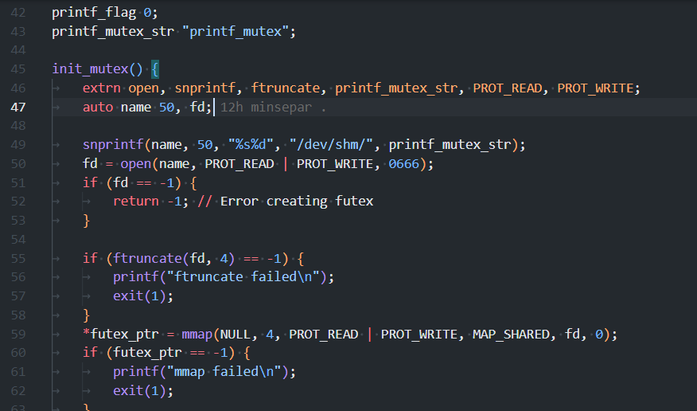
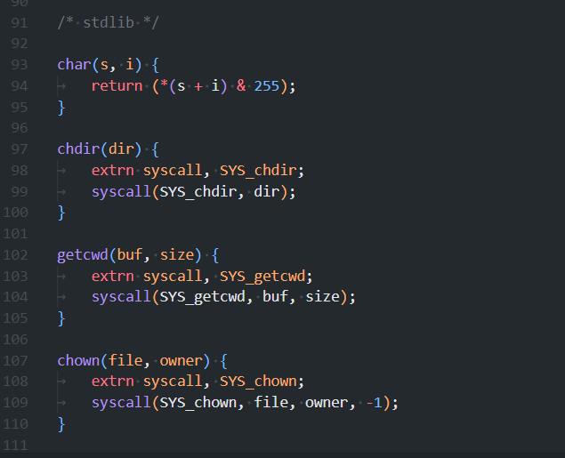

# B-language-support

**B-language-support** is a Visual Studio Code extension that provides syntax highlighting for the B programming language.

## Features

- Syntax highlighting for B language constructs
- Based on the C TextMate grammar, customized for B
- Lightweight and easy to use

## Known Limitations

This extension is still experimental and not thoroughly tested.

## Release Notes

### 1.0.0

Initial release of B-language-support.
